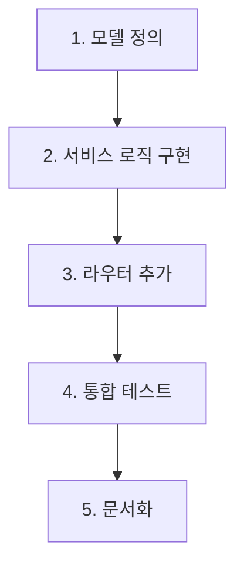

# Python AI 서버 신규 API 추가 작업 계획서

**작성일:** 2025-11-24  
**작성자:** AI Assistant  
**참조 문서:** [PYTHON_API_REQ.md](file:///c:/workspace/oathkeeper_python/docs/PYTHON_API_REQ.md)

---

## 📋 목차

1. [프로젝트 현황 분석](#1-프로젝트-현황-분석)
2. [요구사항 요약](#2-요구사항-요약)
3. [구현 계획](#3-구현-계획)
4. [파일 수정 상세](#4-파일-수정-상세)
5. [테스트 계획](#5-테스트-계획)
6. [위험 요소 및 고려사항](#6-위험-요소-및-고려사항)

---

## 1. 프로젝트 현황 분석

### 1.1 현재 프로젝트 구조

```
oathkeeper_python/
├── app/
│   ├── main.py                 # FastAPI 앱 진입점
│   ├── models.py               # Pydantic 모델 정의
│   ├── storage.py              # 파일 I/O 유틸리티
│   ├── routers/
│   │   ├── metrics.py          # POST /metrics/analyze
│   │   ├── report.py           # GET/POST /metrics/report/{plan_id}/*
│   │   └── llm.py              # POST /metrics/llm/generate
│   └── services/
│       ├── report_service.py   # 리포트 생성 비즈니스 로직
│       ├── llm_adapter.py      # LLM 통합 (스켈레톤)
│       └── llm_client.py       # LLM 클라이언트
├── data/
│   └── plan_{id}/
│       └── metrics.jsonl       # 플랜별 메트릭 데이터
└── docs/
    └── PYTHON_API_REQ.md       # 신규 API 요청 명세
```

### 1.2 기존 API 엔드포인트

| Method | Endpoint                         | 설명                             |
| ------ | -------------------------------- | -------------------------------- |
| POST   | `/metrics/analyze`               | 단일 메트릭 데이터 수집 및 분석  |
| GET    | `/metrics/report/{plan_id}`      | 단일 플랜 리포트 생성            |
| GET    | `/metrics/report/{plan_id}/text` | 단일 플랜 텍스트 리포트 (기본)   |
| POST   | `/metrics/report/{plan_id}/text` | 단일 플랜 텍스트 리포트 (커스텀) |
| POST   | `/metrics/llm/generate`          | LLM 텍스트 생성 (범용)           |

### 1.3 데이터 저장 구조

- **위치**: `data/plan_{id}/metrics.jsonl`
- **형식**: JSONL (JSON Lines) - 각 줄이 하나의 메트릭 레코드
- **필드**:
  ```json
  {
    "plan_id": 1,
    "member_id": 123,
    "distance_km": 5.2,
    "travel_minutes": 25,
    "late_minutes": 0,
    "wait_minutes": 5,
    "created_at": "2025-11-24T12:41:23.154004Z"
  }
  ```

### 1.4 기존 코드 품질 평가

✅ **장점:**

- 명확한 레이어 분리 (routers → services → storage)
- Pydantic을 활용한 타입 안전성
- 단일 책임 원칙 준수 (최근 리팩토링 완료)
- JSONL 기반 간단한 데이터 저장소

⚠️ **주의사항:**

- 최근 라우팅 충돌 수정 이력 존재 ([라우팅*수정*작업\_내역.md](file:///c:/workspace/oathkeeper_python/라우팅_수정_작업_내역.md))
- 신규 API 추가 시 라우팅 충돌 재발 방지 필요
- LLM 통합이 아직 완전하지 않음 (스켈레톤 상태)

---

## 2. 요구사항 요약

### 2.1 신규 API #1: 그룹 누적 데이터 요약

**Endpoint:** `POST /metrics/group/summary`

**기능:**

- 여러 `plan_id`의 메트릭 데이터를 종합하여 그룹 전체 통계 계산
- 총 약속 수, 총/평균 이동 거리, 총/평균 지각 시간 등 제공

**요청 예시:**

```json
{
  "plan_ids": [1, 5, 12, 23]
}
```

**응답 예시:**

```json
{
  "success": true,
  "data": {
    "group_summary": {
      "total_plans_analyzed": 4,
      "total_records": 128,
      "total_distance_km": 258.4,
      "avg_distance_per_plan_km": 64.6,
      "total_late_minutes": 45,
      "avg_late_minutes_per_plan": 11.25
    }
  },
  "warnings": ["plan_id '15' was not found."]
}
```

### 2.2 신규 API #2: 그룹 누적 데이터 자연어 요약

**Endpoint:** `POST /metrics/group/summary/text`

**기능:**

- API #1의 통계 데이터를 기반으로 LLM을 사용하여 자연어 요약 생성
- 스타일, 노트 등 커스터마이징 옵션 지원

**요청 예시:**

```json
{
  "plan_ids": [1, 5, 12, 23],
  "style": "데이터 분석가처럼 객관적인 톤으로",
  "notes": "지각 빈도가 높은 경향이 있는지 분석해주세요."
}
```

**응답 예시:**

```json
{
  "success": true,
  "data": "분석된 4개의 약속에 따르면, 이 그룹은 약속당 평균 64.6km를 이동했으며, 평균 11.25분의 지각 시간을 기록했습니다. 전반적으로 장거리 이동이 잦고, 약속 시간을 준수하는 데 약간의 어려움이 있는 경향을 보입니다."
}
```

### 2.3 에러 처리 정책

| 상황                          | HTTP 상태                | 응답 형식                         |
| ----------------------------- | ------------------------ | --------------------------------- |
| 일부 plan_id 누락/데이터 없음 | 200 OK                   | `success: true` + `warnings` 배열 |
| 모든 plan_id 문제 있음        | 409 Conflict             | `success: false` + 에러 메시지    |
| 잘못된 요청 형식              | 422 Unprocessable Entity | FastAPI 기본 에러                 |

---

## 3. 구현 계획

### 3.1 작업 단계



### 3.2 구현 우선순위

1. **Phase 1: 핵심 기능** (필수)

   - [ ] Pydantic 모델 추가 (`models.py`)
   - [ ] 그룹 요약 서비스 로직 (`group_service.py` 신규)
   - [ ] 그룹 요약 라우터 (`group.py` 신규)

2. **Phase 2: LLM 통합** (필수)

   - [ ] LLM 기반 자연어 요약 기능
   - [ ] Ollama 연동 강화

3. **Phase 3: 에러 처리** (필수)

   - [ ] Warnings 시스템 구현
   - [ ] 부분 성공 처리

4. **Phase 4: 테스트 & 검증** (권장)
   - [ ] 단위 테스트 작성
   - [ ] 통합 테스트 실행

---

## 4. 파일 수정 상세

### 4.1 신규 파일

#### 📄 `app/models.py` (수정)

**추가할 모델:**

```python
# 그룹 요약 요청
class GroupSummaryRequest(BaseModel):
    plan_ids: list[int] = Field(..., min_length=1)

# 그룹 요약 데이터
class GroupSummaryData(BaseModel):
    total_plans_analyzed: int
    total_records: int
    total_distance_km: float
    avg_distance_per_plan_km: float
    total_travel_minutes: int
    avg_travel_minutes_per_plan: float
    total_late_minutes: int
    avg_late_minutes_per_plan: float
    total_wait_minutes: int
    avg_wait_minutes_per_plan: float

# 그룹 요약 응답
class GroupSummaryResponse(BaseModel):
    success: bool
    data: GroupSummaryData
    warnings: Optional[list[str]] = None

# 그룹 텍스트 요약 요청
class GroupTextSummaryRequest(BaseModel):
    plan_ids: list[int] = Field(..., min_length=1)
    style: str = ""
    notes: str = ""
    mode: str = "llm"  # "rules" | "prompt" | "llm"
    seed: Optional[int] = None

# 그룹 텍스트 요약 응답
class GroupTextSummaryResponse(BaseModel):
    success: bool
    data: str
    warnings: Optional[list[str]] = None
```

**복잡도:** 낮음 (기존 패턴 재사용)

---

#### 📄 `app/services/group_service.py` (신규)

**역할:**

- 여러 plan_id의 메트릭 데이터 집계
- 그룹 통계 계산
- LLM 프롬프트 생성 및 호출

**주요 함수:**

```python
def compute_group_summary(plan_ids: list[int]) -> tuple[dict, list[str]]:
    """
    여러 플랜의 메트릭을 집계하여 그룹 요약 생성

    Returns:
        (summary_dict, warnings_list)
    """
    pass

def group_summary_to_text(
    summary: dict,
    style: str = "",
    notes: str = "",
    mode: str = "llm"
) -> str:
    """
    그룹 요약 데이터를 자연어로 변환
    """
    pass
```

**복잡도:** 중간 (기존 `report_service.py`의 `compute_summary` 로직 재사용 가능)

---

#### 📄 `app/routers/group.py` (신규)

**역할:**

- 그룹 관련 API 엔드포인트 정의
- 요청 검증 및 응답 포맷팅

**엔드포인트:**

```python
@router.post("/group/summary")
async def get_group_summary(req: GroupSummaryRequest) -> GroupSummaryResponse:
    """POST /metrics/group/summary"""
    pass

@router.post("/group/summary/text")
async def get_group_summary_text(req: GroupTextSummaryRequest) -> GroupTextSummaryResponse:
    """POST /metrics/group/summary/text"""
    pass
```

**복잡도:** 낮음 (기존 `report.py` 패턴 재사용)

---

### 4.2 수정 파일

#### 📄 `app/main.py` (수정)

**변경 내용:**

- 신규 그룹 라우터 등록

```python
from app.routers.group import router as group_router

def create_app() -> FastAPI:
    app = FastAPI(title="Oathkeeper Metrics Analyzer (Modular)")
    app.include_router(metrics_router, prefix="/metrics", tags=["metrics"])
    app.include_router(report_router,  prefix="/metrics", tags=["report"])
    app.include_router(llm_router,     prefix="/metrics", tags=["llm"])
    app.include_router(group_router,   prefix="/metrics", tags=["group"])  # 신규
    return app
```

**복잡도:** 매우 낮음 (1줄 추가)

---

#### 📄 `app/storage.py` (수정 가능성)

**현재 상태:**

- `iter_metrics(plan_id)`: 단일 플랜의 메트릭 반복자 제공

**필요 여부:**

- 기존 함수로 충분 (여러 plan_id를 순회하며 호출 가능)
- **수정 불필요**

---

#### 📄 `app/services/report_service.py` (참조만)

**활용 방법:**

- `compute_summary()` 로직을 참고하여 `compute_group_summary()` 구현
- `_llm_text_with_ollama()` 함수 재사용 또는 참조

**복잡도:** 없음 (수정 불필요, 참조만)

---

### 4.3 최종 엔드포인트 구조 (신규 API 추가 후)

| Method   | Endpoint                          | 설명                      | 파일           |
| -------- | --------------------------------- | ------------------------- | -------------- |
| POST     | `/metrics/analyze`                | 단일 메트릭 수집          | `metrics.py`   |
| GET      | `/metrics/report/{plan_id}`       | 단일 플랜 리포트          | `report.py`    |
| GET      | `/metrics/report/{plan_id}/text`  | 단일 플랜 텍스트 (기본)   | `report.py`    |
| POST     | `/metrics/report/{plan_id}/text`  | 단일 플랜 텍스트 (커스텀) | `report.py`    |
| POST     | `/metrics/llm/generate`           | LLM 범용 생성             | `llm.py`       |
| **POST** | **`/metrics/group/summary`**      | **그룹 통계 요약** ✨     | **`group.py`** |
| **POST** | **`/metrics/group/summary/text`** | **그룹 자연어 요약** ✨   | **`group.py`** |

> ✨ = 신규 추가

---

## 5. 테스트 계획

### 5.1 단위 테스트

#### `test_group_service.py`

```python
def test_compute_group_summary_success():
    """정상적인 그룹 요약 계산"""
    pass

def test_compute_group_summary_partial_failure():
    """일부 plan_id 누락 시 warnings 반환"""
    pass

def test_compute_group_summary_all_failure():
    """모든 plan_id 실패 시 예외 발생"""
    pass

def test_group_summary_to_text():
    """LLM 텍스트 생성"""
    pass
```

### 5.2 통합 테스트 (수동)

#### 테스트 케이스 1: 정상 그룹 요약

```bash
POST http://localhost:8001/metrics/group/summary
Content-Type: application/json

{
  "plan_ids": [1, 2]
}
```

**예상 응답:**

```json
{
  "success": true,
  "data": {
    "total_plans_analyzed": 2,
    "total_records": 50,
    "total_distance_km": 120.5,
    "avg_distance_per_plan_km": 60.25,
    ...
  }
}
```

#### 테스트 케이스 2: 일부 plan_id 누락

```bash
POST http://localhost:8001/metrics/group/summary
Content-Type: application/json

{
  "plan_ids": [1, 999]
}
```

**예상 응답:**

```json
{
  "success": true,
  "data": {
    "total_plans_analyzed": 1,
    ...
  },
  "warnings": [
    "plan_id '999' was not found."
  ]
}
```

#### 테스트 케이스 3: 모든 plan_id 실패

```bash
POST http://localhost:8001/metrics/group/summary
Content-Type: application/json

{
  "plan_ids": [888, 999]
}
```

**예상 응답:**

```json
{
  "success": false,
  "data": null,
  "message": "No data available for the given plan_ids."
}
```

**HTTP 상태:** 409 Conflict

#### 테스트 케이스 4: 그룹 텍스트 요약

```bash
POST http://localhost:8001/metrics/group/summary/text
Content-Type: application/json

{
  "plan_ids": [1, 2],
  "style": "친근한 톤으로",
  "notes": "긍정적인 면을 강조해주세요."
}
```

**예상 응답:**

```json
{
  "success": true,
  "data": "여러분의 그룹은 총 2개의 약속을 통해 평균 60km를 이동했어요! 시간 관리도 잘 하고 계시네요. 👍"
}
```

### 5.3 성능 테스트

- **대량 plan_ids 처리**: 100개 이상의 plan_id 요청 시 응답 시간 측정
- **메모리 사용량**: 대용량 JSONL 파일 처리 시 메모리 누수 확인

---

## 6. 위험 요소 및 고려사항

### 6.1 라우팅 충돌 위험 ⚠️

**문제:**

- 최근 `/metrics/report` 경로에서 충돌 이력 존재
- 신규 `/metrics/group/*` 경로가 기존 경로와 충돌 가능성

**해결책:**

- ✅ 신규 라우터를 별도 파일 (`group.py`)로 분리
- ✅ 명확한 prefix 사용 (`/group/summary`)
- ✅ 기존 라우터와 독립적으로 등록

### 6.2 데이터 일관성 ⚠️

**문제:**

- JSONL 파일이 손상되거나 형식이 잘못된 경우
- 일부 plan_id의 데이터가 없는 경우

**해결책:**

- ✅ `storage.py`의 `iter_metrics()`가 이미 예외 처리 구현
- ✅ Warnings 시스템으로 부분 실패 허용
- ✅ 빈 데이터 처리 로직 추가

### 6.3 LLM 통합 불확실성 ⚠️

**문제:**

- 현재 `llm_adapter.py`가 스켈레톤 상태
- Ollama 서버 연결 실패 가능성

**해결책:**

- ✅ `report_service.py`의 `_llm_text_with_ollama()` 재사용
- ✅ LLM 실패 시 fallback으로 rules 모드 사용
- ✅ 환경 변수로 LLM 백엔드 선택 가능하게 구현

### 6.4 성능 문제 ⚠️

**문제:**

- 수십 개의 plan_id 처리 시 I/O 병목 가능성
- 대용량 JSONL 파일 메모리 로드

**해결책:**

- ✅ Generator 패턴 사용 (`iter_metrics()`)
- ⚠️ 필요시 비동기 I/O 고려 (향후 개선)
- ⚠️ 캐싱 전략 고려 (향후 개선)

### 6.5 에러 응답 일관성 🔍

**문제:**

- 기존 API는 409 Conflict를 사용하지만, 신규 API는 200 OK + warnings 사용
- Spring 서버와의 에러 처리 규약 확인 필요

**해결책:**

- ✅ 요구사항 명세대로 구현 (200 OK + warnings)
- 🔍 **Spring 팀과 에러 응답 형식 재확인 필요**

---

## 7. 구현 체크리스트

### Phase 1: 모델 및 서비스 로직

- [ ] `models.py`에 그룹 요약 관련 Pydantic 모델 추가
- [ ] `app/services/group_service.py` 파일 생성
- [ ] `compute_group_summary()` 함수 구현
  - [ ] 여러 plan_id 순회
  - [ ] 메트릭 데이터 집계
  - [ ] 통계 계산
  - [ ] Warnings 생성
- [ ] `group_summary_to_text()` 함수 구현
  - [ ] LLM 프롬프트 생성
  - [ ] Ollama 호출
  - [ ] 응답 정제

### Phase 2: 라우터 및 통합

- [ ] `app/routers/group.py` 파일 생성
- [ ] `POST /group/summary` 엔드포인트 구현
- [ ] `POST /group/summary/text` 엔드포인트 구현
- [ ] `main.py`에 그룹 라우터 등록
- [ ] 에러 처리 구현
  - [ ] 부분 성공 (200 + warnings)
  - [ ] 완전 실패 (409 Conflict)

### Phase 3: 테스트

- [ ] 정상 케이스 테스트
- [ ] 일부 plan_id 누락 테스트
- [ ] 모든 plan_id 실패 테스트
- [ ] LLM 텍스트 생성 테스트
- [ ] 성능 테스트 (대량 plan_ids)

### Phase 4: 문서화

- [ ] API 문서 업데이트 (Swagger/OpenAPI)
- [ ] README 업데이트
- [ ] 작업 완료 보고서 작성

---

## 8. 예상 작업 시간

| 단계             | 예상 시간   | 비고                 |
| ---------------- | ----------- | -------------------- |
| 모델 정의        | 30분        | 기존 패턴 재사용     |
| 서비스 로직 구현 | 2-3시간     | 집계 로직 + LLM 통합 |
| 라우터 구현      | 1시간       | 기존 패턴 재사용     |
| 테스트           | 1-2시간     | 수동 + 자동 테스트   |
| 문서화           | 30분        |                      |
| **총 예상 시간** | **5-7시간** | 순수 개발 시간       |

---

## 9. 다음 단계

### 즉시 실행 가능한 작업

1. ✅ 이 계획서 검토 및 승인 요청
2. ⏭️ Spring 팀과 에러 응답 형식 재확인
3. ⏭️ Phase 1 구현 시작

### 승인 후 작업 순서

1. `models.py` 수정
2. `group_service.py` 구현
3. `group.py` 라우터 구현
4. `main.py` 통합
5. 테스트 실행
6. 문서화

---

## 10. 질문 사항

> 🔍 **Spring 개발팀에 확인 필요:**

1. **에러 응답 형식 확인**

   - 부분 성공 시 `200 OK + warnings` 형식이 Spring 서버에서 처리 가능한가요?
   - 기존 API들과의 일관성은 괜찮은가요?

2. **plan_ids 개수 제한**

   - 한 번에 요청 가능한 최대 plan_id 개수 제한이 필요한가요?
   - 예: 최대 100개까지만 허용

3. **LLM 모드 선택**

   - 그룹 텍스트 요약에서 기본 모드를 "llm"으로 할까요, "rules"로 할까요?
   - Ollama 서버가 항상 실행 중인가요?

4. **추가 통계 필드**
   - 요구사항 명세에 없는 추가 통계가 필요한가요?
   - 예: 최대/최소 이동 거리, 중앙값 등

---

## 11. 참고 자료

- [PYTHON_API_REQ.md](file:///c:/workspace/oathkeeper_python/docs/PYTHON_API_REQ.md) - 신규 API 요청 명세
- [라우팅*수정*작업\_내역.md](file:///c:/workspace/oathkeeper_python/라우팅_수정_작업_내역.md) - 최근 리팩토링 이력
- [app/services/report_service.py](file:///c:/workspace/oathkeeper_python/app/services/report_service.py) - 참고할 기존 로직
- [app/routers/report.py](file:///c:/workspace/oathkeeper_python/app/routers/report.py) - 참고할 라우터 패턴

---

## 부록: 코드 스니펫 예시

### A. `compute_group_summary()` 의사 코드

```python
def compute_group_summary(plan_ids: list[int]) -> tuple[dict, list[str]]:
    warnings = []
    all_records = []
    valid_plan_ids = []

    for plan_id in plan_ids:
        if not has_plan_dir(plan_id):
            warnings.append(f"plan_id '{plan_id}' was not found.")
            continue

        records = list(iter_metrics(plan_id))
        if not records:
            warnings.append(f"plan_id '{plan_id}' has no metrics data.")
            continue

        all_records.extend(records)
        valid_plan_ids.append(plan_id)

    if not all_records:
        raise HTTPException(
            status_code=409,
            detail={"code": "NO_DATA", "message": "No data available for the given plan_ids."}
        )

    # 집계 로직
    total_records = len(all_records)
    total_distance = sum(r.get("distance_km", 0) for r in all_records)
    total_late = sum(r.get("late_minutes", 0) or 0 for r in all_records)
    # ... 기타 통계 계산

    summary = {
        "total_plans_analyzed": len(valid_plan_ids),
        "total_records": total_records,
        "total_distance_km": total_distance,
        "avg_distance_per_plan_km": total_distance / len(valid_plan_ids),
        # ...
    }

    return summary, warnings
```

### B. LLM 프롬프트 예시

```python
def _build_group_prompt(summary: dict, style: str, notes: str) -> str:
    base = f"""
다음은 {summary['total_plans_analyzed']}개의 약속에 대한 그룹 통계입니다:

- 총 기록 수: {summary['total_records']}개
- 총 이동 거리: {summary['total_distance_km']:.1f}km
- 약속당 평균 이동 거리: {summary['avg_distance_per_plan_km']:.1f}km
- 총 지각 시간: {summary['total_late_minutes']}분
- 약속당 평균 지각 시간: {summary['avg_late_minutes_per_plan']:.1f}분

위 데이터를 바탕으로 이 그룹의 전반적인 활동 패턴을 요약해주세요.
"""

    if style:
        base += f"\n스타일: {style}"
    if notes:
        base += f"\n추가 요청: {notes}"

    return base
```

---

**작성 완료일:** 2025-11-24  
**검토 요청:** Spring 서버 개발팀  
**다음 단계:** 승인 후 Phase 1 구현 시작
