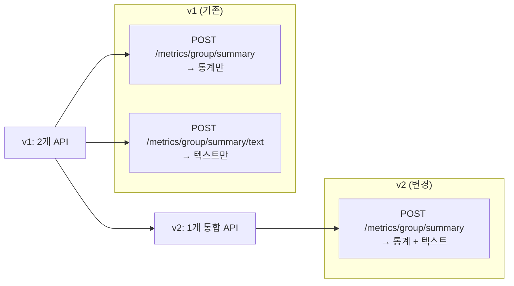

# Python AI 서버 API v2 구현 완료 회신

**버전:** v2.0  
**작성일:** 2025-11-25  
**작성자:** Python AI 서버 개발팀  
**참조 문서:** [PYTHON_API_REQ.md (v2)](file:///c:/workspace/oathkeeper_python/docs/PYTHON_API_REQ.md)

## 목차

- [구현 상태](#구현-상태)
- [변경사항 요약](#변경사항-요약)
- [API 명세](#api-명세)
- [요청/응답 예시](#요청응답-예시)
- [오류 처리](#오류-처리)
- [Java/Spring 연동 가이드](#java-spring-연동-가이드)
- [테스트 방법](#테스트-방법)
- [FAQ](#faq)
- [문의사항](#문의사항)

---

## ✅ 구현 상태

### 요청사항 검토 결과

v2 명세에 따라 **그룹 통합 요약 API** 구현을 완료하였습니다.

| 항목                 | 상태    | 비고                                      |
| -------------------- | ------- | ----------------------------------------- |
| API 통합 (2개 → 1개) | ✅ 완료 | `/metrics/group/summary` 단일 엔드포인트  |
| 개별 플랜 요약 API   | ✅ 완료 | `/metrics/plan/{plan_id}/summary` 추가    |
| 요청 파라미터 추가   | ✅ 완료 | `style`, `notes` 필드 추가                |
| 응답 구조 변경       | ✅ 완료 | `group_summary` + `text_summary` 통합     |
| 에러 처리            | ✅ 완료 | 부분 성공(200 + warnings), 전체 실패(409) |
| 테스트 완료          | ✅ 완료 | 정상/경고/에러 케이스 검증                |

---

## 📋 변경사항 요약

### v1 → v2 주요 변경



### 변경 세부사항

| 구분           | v1                                                                          | v2                                                              |
| -------------- | --------------------------------------------------------------------------- | --------------------------------------------------------------- |
| **엔드포인트** | 2개 분리<br/>- `/metrics/group/summary`<br/>- `/metrics/group/summary/text` | 1개 통합<br/>- `/metrics/group/summary`                         |
| **요청 필드**  | `plan_ids`                                                                  | `plan_ids`, `style`, `notes`, `mode`                            |
| **응답 구조**  | `{ "data": { 통계 필드들... } }`                                            | `{ "data": { "group_summary": {...}, "text_summary": "..." } }` |
| **호출 횟수**  | 2회 (통계 + 텍스트)                                                         | 1회 (통합)                                                      |

---

## 🔧 API 명세

### 1. 그룹 통합 요약 (Group Summary)

#### Endpoint

```
POST /metrics/group/summary
```

### 요청 형식

**Content-Type:** `application/json`

```json
{
  "plan_ids": [1, 5, 12, 23],
  "style": "데이터 분석가처럼 객관적인 톤으로",
  "notes": "지각 빈도가 높은 경향이 있는지 분석해주세요.",
  "mode": "llm"
}
```

#### 필드 설명

| 필드       | 타입             | 필수    | 기본값  | 설명                                |
| ---------- | ---------------- | ------- | ------- | ----------------------------------- |
| `plan_ids` | `array<integer>` | ✅ 필수 | -       | 분석할 plan_id 목록 (최소 1개)      |
| `style`    | `string`         | 선택    | `""`    | 텍스트 스타일 (예: "친근한 톤으로") |
| `notes`    | `string`         | 선택    | `""`    | 추가 요청사항                       |
| `mode`     | `string`         | 선택    | `"llm"` | 생성 모드: `"rules"` or `"llm"`     |

---

### 응답 형식

#### 정상 응답 (200 OK)

```json
{
  "success": true,
  "data": {
    "group_summary": {
      "total_plans_analyzed": 4,
      "total_records": 128,
      "total_distance_km": 258.4,
      "avg_distance_per_plan_km": 64.6,
      "total_travel_minutes": 450,
      "avg_travel_minutes_per_plan": 112.5,
      "total_late_minutes": 45,
      "avg_late_minutes_per_plan": 11.25,
      "total_wait_minutes": 20,
      "avg_wait_minutes_per_plan": 5.0
    },
    "text_summary": "분석된 4개의 약속에 따르면, 이 그룹은 약속당 평균 64.6km를 이동했으며, 평균 11.25분의 지각 시간을 기록했습니다. 전반적으로 장거리 이동이 잦고, 약속 시간을 준수하는 데 약간의 어려움이 있는 경향을 보입니다."
  },
  "warnings": null
}
```

#### 부분 성공 응답 (200 OK + warnings)

일부 plan_id에 문제가 있는 경우:

```json
{
  "success": true,
  "data": {
    "group_summary": {
      "total_plans_analyzed": 3,
      "total_records": 96,
      ...
    },
    "text_summary": "분석된 3개의 약속에 따르면..."
  },
  "warnings": [
    "plan_id '15' was not found.",
    "plan_id '23' has no metrics data."
  ]
}
```

#### 전체 실패 응답 (409 Conflict)

모든 plan_id에 문제가 있는 경우:

```json
{
  "success": false,
  "data": null,
  "message": "No data available for the given plan_ids."
}
```

---

### 2. 개별 플랜 요약 (Individual Plan Summary)

#### Endpoint

```
POST /metrics/plan/{plan_id}/summary
```

#### 요청 형식

- **Path Parameter**: `plan_id` (integer, required)
- **Body**: 없음

#### 응답 형식

**정상 응답 (200 OK)**

```json
{
  "success": true,
  "data": {
    "plan_id": 2,
    "text_summary": "약속 #2의 요약입니다. 총 이동 거리는 23.63km, 총 이동 시간은 200분이었습니다..."
  }
}
```

**실패 응답 (409 Conflict)**

- 해당 Plan에 대한 메트릭 데이터가 없거나, 아직 종료되지 않아 요약할 수 없는 경우

```json
{
  "detail": {
    "code": "NOT_READY",
    "message": "Plan not finished or no metrics yet."
  }
}
```

---

## ☕ Java/Spring 연동 가이드

### 1. DTO 클래스 수정

#### 기존 v1 클래스 삭제/통합

```java
// ❌ 삭제: GroupTextSummaryRequest.java
// ❌ 삭제: GroupTextSummaryResponse.java
```

#### 수정: GroupSummaryRequest.java

```java
package com.oathkeeper.dto.request;

import lombok.AllArgsConstructor;
import lombok.Builder;
import lombok.Data;
import lombok.NoArgsConstructor;
import javax.validation.constraints.NotEmpty;
import java.util.List;

@Data
@Builder
@NoArgsConstructor
@AllArgsConstructor
public class GroupSummaryRequest {

    @NotEmpty(message = "plan_ids는 최소 1개 이상이어야 합니다")
    private List<Long> planIds;

    // ✨ v2 신규 필드
    @Builder.Default
    private String style = "";

    @Builder.Default
    private String notes = "";

    @Builder.Default
    private String mode = "llm";  // "rules" | "llm"
}
```

#### 신규: GroupSummaryStats.java

```java
package com.oathkeeper.dto.response;

import com.fasterxml.jackson.annotation.JsonProperty;
import lombok.AllArgsConstructor;
import lombok.Builder;
import lombok.Data;
import lombok.NoArgsConstructor;

@Data
@Builder
@NoArgsConstructor
@AllArgsConstructor
public class GroupSummaryStats {

    @JsonProperty("total_plans_analyzed")
    private Integer totalPlansAnalyzed;

    @JsonProperty("total_records")
    private Integer totalRecords;

    @JsonProperty("total_distance_km")
    private Double totalDistanceKm;

    @JsonProperty("avg_distance_per_plan_km")
    private Double avgDistancePerPlanKm;

    @JsonProperty("total_travel_minutes")
    private Integer totalTravelMinutes;

    @JsonProperty("avg_travel_minutes_per_plan")
    private Double avgTravelMinutesPerPlan;

    @JsonProperty("total_late_minutes")
    private Integer totalLateMinutes;

    @JsonProperty("avg_late_minutes_per_plan")
    private Double avgLateMinutesPerPlan;

    @JsonProperty("total_wait_minutes")
    private Integer totalWaitMinutes;

    @JsonProperty("avg_wait_minutes_per_plan")
    private Double avgWaitMinutesPerPlan;
}
```

#### 수정: GroupSummaryResponse.java

```java
package com.oathkeeper.dto.response;

import com.fasterxml.jackson.annotation.JsonProperty;
import lombok.AllArgsConstructor;
import lombok.Builder;
import lombok.Data;
import lombok.NoArgsConstructor;
import java.util.List;

@Data
@Builder
@NoArgsConstructor
@AllArgsConstructor
public class GroupSummaryResponse {

    private Boolean success;
    private GroupSummaryData data;  // ✨ 구조 변경
    private List<String> warnings;

    @Data
    @Builder
    @NoArgsConstructor
    @AllArgsConstructor
    public static class GroupSummaryData {

        @JsonProperty("group_summary")
        private GroupSummaryStats groupSummary;  // ✨ 통계 데이터

        @JsonProperty("text_summary")
        private String textSummary;  // ✨ 자연어 요약
    }
}
```

---

### 2. Service 클래스 수정

#### PythonAiClient.java

```java
@Slf4j
@Service
@RequiredArgsConstructor
public class PythonAiClient {

    private final RestTemplate restTemplate;

    @Value("${python.ai.base-url:http://localhost:8001}")
    private String pythonAiBaseUrl;

    /**
     * 그룹 통합 요약 조회 (v2: 통계 + 텍스트)
     *
     * @param planIds 분석할 plan_id 목록
     * @param style 텍스트 스타일 (선택)
     * @param notes 추가 요청사항 (선택)
     * @param mode 생성 모드 (선택, 기본값: "llm")
     * @return 그룹 통계 + 자연어 요약
     */
    public GroupSummaryResponse getGroupSummary(
            List<Long> planIds,
            String style,
            String notes,
            String mode
    ) {
        String url = pythonAiBaseUrl + "/metrics/group/summary";

        GroupSummaryRequest request = GroupSummaryRequest.builder()
                .planIds(planIds)
                .style(style != null ? style : "")
                .notes(notes != null ? notes : "")
                .mode(mode != null ? mode : "llm")
                .build();

        HttpHeaders headers = new HttpHeaders();
        headers.setContentType(MediaType.APPLICATION_JSON);
        HttpEntity<GroupSummaryRequest> entity = new HttpEntity<>(request, headers);

        try {
            ResponseEntity<GroupSummaryResponse> response = restTemplate.exchange(
                    url,
                    HttpMethod.POST,
                    entity,
                    GroupSummaryResponse.class
            );

            GroupSummaryResponse body = response.getBody();

            // warnings 로깅
            if (body != null && body.getWarnings() != null && !body.getWarnings().isEmpty()) {
                log.warn("그룹 요약 조회 시 경고: {}", body.getWarnings());
            }

            return body;

        } catch (HttpClientErrorException.Conflict e) {
            log.error("그룹 요약 조회 실패 - 데이터 없음: planIds={}", planIds);
            throw new PythonAiException("분석 가능한 데이터가 없습니다", e);

        } catch (Exception e) {
            log.error("그룹 요약 조회 중 오류 발생: planIds={}", planIds, e);
            throw new PythonAiException("Python AI 서버 통신 실패", e);
        }
    }

    /**
     * 간편 메서드: 기본 설정으로 그룹 요약 조회
     */
    public GroupSummaryResponse getGroupSummarySimple(List<Long> planIds) {
        return getGroupSummary(planIds, null, null, "rules");  // rules 모드로 빠른 응답
    }
}
```

---

### 3. 사용 예제

#### 예제 1: 기본 사용

```java
@Service
@RequiredArgsConstructor
public class ChatRoomService {

    private final PythonAiClient pythonAiClient;

    public ChatRoomStatistics getChatRoomStatistics(Long chatRoomId) {
        List<Long> planIds = getPlanIds(chatRoomId);

        // v2 API 호출 (통계 + 텍스트 한 번에)
        GroupSummaryResponse response = pythonAiClient.getGroupSummary(
                planIds,
                "친근한 톤으로",
                "긍정적인 면을 강조해주세요",
                "llm"
        );

        // 통계 데이터 접근
        GroupSummaryStats stats = response.getData().getGroupSummary();
        log.info("총 약속 수: {}", stats.getTotalPlansAnalyzed());

        // 자연어 요약 접근
        String summary = response.getData().getTextSummary();
        log.info("요약: {}", summary);

        return ChatRoomStatistics.from(stats, summary);
    }
}
```

#### 예제 2: 빠른 응답 (rules 모드)

```java
// LLM 없이 빠른 응답 (1~2초 이내)
GroupSummaryResponse response = pythonAiClient.getGroupSummary(
        planIds,
        "",      // style 없음
        "",      // notes 없음
        "rules"  // rules 모드
);
```

#### 예제 3: 상세 분석 (llm 모드)

```java
// LLM으로 상세 분석 (5~30초 소요)
GroupSummaryResponse response = pythonAiClient.getGroupSummary(
        planIds,
        "데이터 분석가처럼 객관적인 톤으로",
        "지각 빈도가 높은 경향이 있는지 분석해주세요",
        "llm"
);
```

---

## ⚠️ 주의사항

### 1. 하위 호환성

> **중요:** v1 API(`/metrics/group/summary/text`)는 **삭제**되었습니다.

**영향:**

- 기존 v1 API를 사용 중인 코드는 **동작하지 않습니다**
- v2 API로 마이그레이션 필요

**마이그레이션 가이드:**

```java
// ❌ v1 (동작 안 함)
GroupSummaryResponse statsResponse = client.getGroupSummary(planIds);
GroupTextSummaryResponse textResponse = client.getGroupSummaryText(planIds, style, notes);

// ✅ v2 (한 번의 호출)
GroupSummaryResponse response = client.getGroupSummary(planIds, style, notes, "llm");
GroupSummaryStats stats = response.getData().getGroupSummary();
String text = response.getData().getTextSummary();
```

---

### 2. 응답 시간

| 모드    | 예상 응답 시간 | 권장 사용처                    |
| ------- | -------------- | ------------------------------ |
| `rules` | 1~2초          | 실시간 조회, 빠른 응답 필요 시 |
| `llm`   | 5~30초         | 상세 분석, 비동기 처리         |

**권장:**

- 사용자 대면 API: `mode="rules"` (빠른 응답)
- 백그라운드 작업: `mode="llm"` (상세 분석)

---

### 3. Timeout 설정

```java
@Configuration
public class RestTemplateConfig {

    @Bean
    public RestTemplate restTemplate(RestTemplateBuilder builder) {
        return builder
                .setConnectTimeout(Duration.ofSeconds(5))
                .setReadTimeout(Duration.ofSeconds(35))  // ✨ LLM 모드 고려
                .build();
    }
}
```

---

### 4. 응답 데이터 접근 방법 변경

```java
// ❌ v1
Integer totalPlans = response.getData().getTotalPlansAnalyzed();

// ✅ v2
Integer totalPlans = response.getData().getGroupSummary().getTotalPlansAnalyzed();
String summary = response.getData().getTextSummary();
```

---

## 🧪 테스트 방법

### 1. Swagger UI

브라우저에서 접속:

```
http://localhost:8001/docs
```

**테스트 시나리오:**

1. `POST /metrics/group/summary` 선택
2. "Try it out" 클릭
3. 요청 Body 입력:

```json
{
  "plan_ids": [1, 2],
  "style": "친근한 톤으로",
  "notes": "긍정적인 면을 강조해주세요",
  "mode": "rules"
}
```

4. "Execute" 클릭
5. 응답 확인

---

### 2. curl 테스트

```bash
curl -X POST "http://localhost:8001/metrics/group/summary" \
  -H "Content-Type: application/json" \
  -d '{
    "plan_ids": [1, 2],
    "style": "친근한 톤으로",
    "notes": "긍정적인 면을 강조해주세요",
    "mode": "llm"
  }'
```

---

### 3. Java 통합 테스트

```java
@SpringBootTest
class PythonAiClientTest {

    @Autowired
    private PythonAiClient pythonAiClient;

    @Test
    void testGetGroupSummary_v2() {
        // Given
        List<Long> planIds = Arrays.asList(1L, 2L);

        // When
        GroupSummaryResponse response = pythonAiClient.getGroupSummary(
                planIds,
                "친근한 톤으로",
                "긍정적인 면을 강조해주세요",
                "rules"
        );

        // Then
        assertThat(response.getSuccess()).isTrue();
        assertThat(response.getData()).isNotNull();

        // 통계 데이터 검증
        GroupSummaryStats stats = response.getData().getGroupSummary();
        assertThat(stats.getTotalPlansAnalyzed()).isEqualTo(2);
        assertThat(stats.getTotalRecords()).isGreaterThan(0);

        // 텍스트 요약 검증
        String text = response.getData().getTextSummary();
        assertThat(text).isNotBlank();
        assertThat(text).contains("약속");
    }
}
```

---

## 📊 변경 영향도 분석

### 영향을 받는 부분

| 영역           | 영향도 | 수정 필요            |
| -------------- | ------ | -------------------- |
| DTO 클래스     | 높음   | ✅ 필수              |
| Service 클래스 | 중간   | ✅ 필수              |
| Controller     | 중간   | ✅ 필수 (v1 사용 시) |
| DB 스키마      | 없음   | ❌ 불필요            |
| 프론트엔드     | 중간   | ⚠️ v1 사용 확인 필요 |

### 마이그레이션 체크리스트

- [ ] `GroupSummaryRequest`에 `style`, `notes`, `mode` 필드 추가
- [ ] `GroupSummaryStats` 클래스 생성
- [ ] `GroupSummaryResponse.GroupSummaryData` 구조 변경
- [ ] `GroupTextSummaryRequest`, `GroupTextSummaryResponse` 삭제
- [ ] `PythonAiClient.getGroupSummary()` 메서드 시그니처 변경
- [ ] `getGroupSummaryText()` 메서드 삭제 (통합됨)
- [ ] 기존 v1 호출 코드 v2로 변경
- [ ] Timeout 설정 확인 (최소 35초)
- [ ] 통합 테스트 실행

---

## 💡 FAQ

### Q1. v1 API는 언제까지 사용 가능한가요?

**A:** v1 API(`/metrics/group/summary/text`)는 **즉시 제거**되었습니다. v2로 마이그레이션 필요합니다.

### Q2. 응답 시간이 너무 느린데요?

**A:** `mode="llm"` 사용 시 5~30초 소요됩니다. 빠른 응답이 필요하면 `mode="rules"` 사용을 권장합니다.

### Q3. style과 notes를 생략해도 되나요?

**A:** 네, 선택 필드입니다. 기본값(`""`)으로 동작하며, mode가 `"rules"`인 경우 무시됩니다.

### Q4. warnings가 있으면 어떻게 처리하나요?

**A:** 일부 plan_id가 실패해도 `200 OK`가 반환됩니다. `warnings` 배열을 확인하여 로그에 기록하고, 가능한 데이터만 사용하면 됩니다.

### Q5. 409 Conflict는 언제 발생하나요?

**A:** **모든** plan_id에 문제가 있어 분석할 데이터가 전혀 없을 때 발생합니다.

---

## 📞 문의사항

구현 관련 문의사항이 있으시면 Python AI 서버 개발팀으로 연락 주시기 바랍니다.

**구현 완료일:** 2025-11-25  
**서버 상태:** ✅ 정상 운영 중  
**엔드포인트:** `http://localhost:8001/metrics/group/summary`

## 🚨 문제 해결 가이드

- **404 Not Found** 가 발생한다면 요청 URL이 `/metrics/group/summary` 로 정확히 지정되지 않았을 가능성이 높습니다.
  - FastAPI 라우터는 `app.include_router(group_router, prefix="/metrics")` 로 설정돼 있으므로 **전체 경로**는 `http://<host>:8001/metrics/group/summary` 입니다.
- **클라이언트(예: Spring, curl, Postman)에서**
  - `POST http://localhost:8001/metrics/group/summary` 로 전송했는지 확인합니다.
  - `Content-Type: application/json` 헤더와 올바른 JSON 바디(`planIds`, `style`, `notes`, `mode`)를 포함해야 합니다.
- **FastAPI 서버가 올바른 포트(8001)에서 실행 중인지** 확인합니다. `uvicorn app.main:app --host 0.0.0.0 --port 8001` 로 실행했는지 점검합니다.
- **프록시/리버스 프록시**(NGINX 등)를 사용 중이라면 경로 재작성(rule)이 `/metrics/group/summary` 로 전달되는지 확인합니다.
- **로그 확인**: 서버 로그에 `INFO: 127.0.0.1:xxxxx - "POST /metrics/group/summary"` 와 같은 라인이 보이면 요청이 정상 도착한 것입니다. 없으면 클라이언트 측 URL이 잘못된 것입니다.

위 항목을 점검하면 그룹 요약 API가 정상적으로 호출될 수 있습니다.
